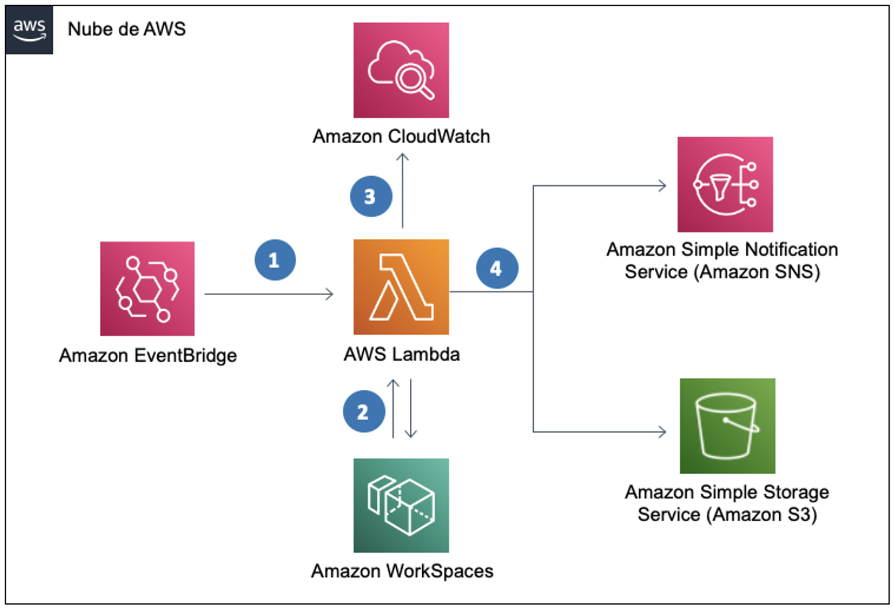

# Report Unused Workspaces

## Getting started

Report Unused Workspaces is a sample code for blog "How to detect Unused Amazon Workspaces". You can install the solution using Cloudformation in your AWS account.

## How it Works

1) An scheduled Amazon Event Bridge scheduled event will trigget a Lambda function
2) Lambda will query the status of Amazon Workspaces using the [DescribeWorkspacesConnectionStatus API](https://docs.aws.amazon.com/workspaces/latest/api/API_DescribeWorkspacesConnectionStatus.html). 
3) The Lambda logs will be saved in Amazon CloudWatch logs
4) The report will be uploaded in CSV format into a Amazon S3 bucket and sent by email using Amazon Simple Notification Service (SNS)

## Installation

1) Upload the unused-workspaces-report.yaml into AWS Cloudformation
2) Configure the following parametes
    - Days: Set a number of days to report unused WorkSpaces.    
    - EmailAddress: Set one Email address to receive a report of the unused WorkSpaces
    - ExecutionRate: every how many days do you want to run this solution?
3) Confirm the SNS Subscription Confirmation
4) The results will be received in the configured email address and saved in a Bucket named unusedworkspaces-\<AWS Account Number\>

## Security

See [CONTRIBUTING](CONTRIBUTING.md#security-issue-notifications) for more information.

## License

This library is licensed under the MIT-0 License. See the LICENSE file.
