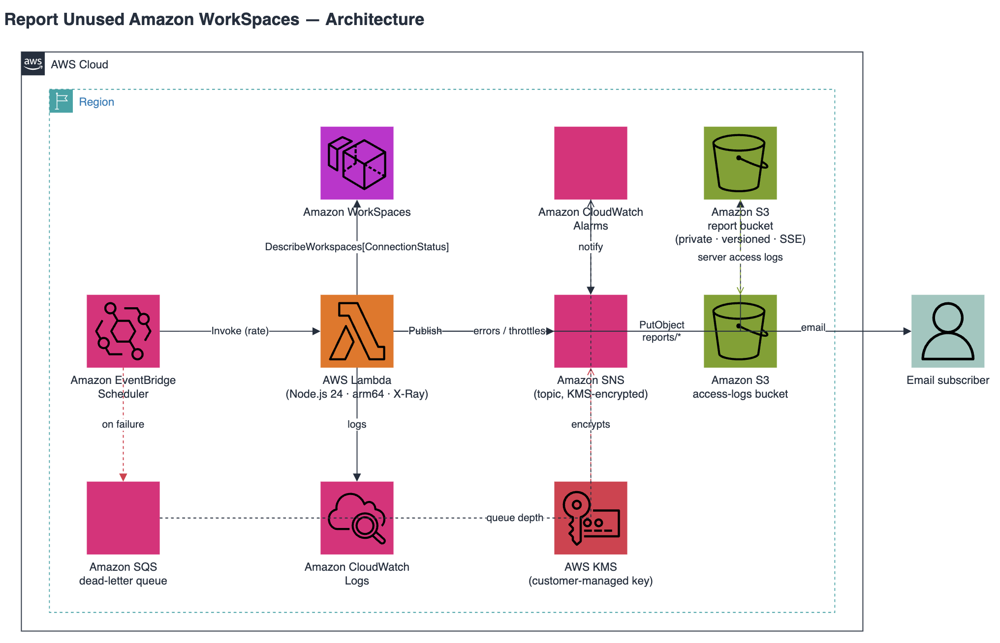

<!-- Seletor de idioma -->
**🌐 Idioma:** [English](./README.md) · [Español](./README.es.md) · Português

# Relatório de Amazon WorkSpaces sem uso (CDK)

Detecta e relata os Amazon WorkSpaces que não foram utilizados por N dias, em
seguida envia um resumo por e-mail e arquiva um CSV no S3. Implementação
modernizada construída com **AWS CDK v2 + TypeScript**, **AWS Lambda Node.js 24**
em **Graviton (arm64)**, **AWS SDK v3**, **Amazon EventBridge Scheduler**, alarmes
operacionais com fila de mensagens mortas (DLQ) e padrões de segurança validados
com **cdk-nag**.

> [!NOTE]
> Este projeto foi modernizado de um modelo de CloudFormation em arquivo único
> para um aplicativo CDK v2. Faça a implantação usando o aplicativo CDK descrito
> abaixo.

## Sumário

- [Arquitetura](#arquitetura)
- [Como funciona](#como-funciona)
- [Segurança por padrão](#segurança-por-padrão)
- [Pré-requisitos](#pré-requisitos)
- [Configuração](#configuração)
- [Visão FinOps](#visão-finops)
- [Implantação](#implantação)
- [Testes](#testes)
- [Limpeza](#limpeza)
- [Custos](#custos)
- [Estrutura do projeto](#estrutura-do-projeto)
- [Roteiro](#roteiro)
- [Contribuição e segurança](#contribuição-e-segurança)
- [Licença](#licença)

## Arquitetura



> O arquivo editável é [`images/report-unused-workspaces-architecture.drawio`](./images/report-unused-workspaces-architecture.drawio)
> (abra com [draw.io](https://draw.io) / diagrams.net). Exporte o PNG novamente após editar.

| Componente | Serviço | Finalidade |
| --- | --- | --- |
| Agendador | Amazon EventBridge Scheduler | Aciona a função a cada `executionRateDays` dias |
| Computação | AWS Lambda (Node.js 24, arm64) | Consulta os WorkSpaces e monta o relatório |
| Notificação | Amazon SNS (criptografado com KMS) | Envia o resumo por e-mail aos assinantes |
| Armazenamento | Amazon S3 (privado, com versionamento) | Arquiva o relatório CSV em `reports/` |
| Resiliência | Amazon SQS (fila de mensagens mortas) | Captura as invocações agendadas com falha |
| Alertas | Amazon CloudWatch Alarms | Notifica erros/throttling da Lambda e mensagens na DLQ |
| Observabilidade | Amazon CloudWatch Logs + AWS X-Ray | Registra e rastreia cada execução |

## Como funciona

1. O **EventBridge Scheduler** invoca a função Lambda com uma cadência configurável.
2. A **Lambda** chama `workspaces:DescribeWorkspacesConnectionStatus` (com
   paginação) e calcula, por workspace, o número de dias desde a última conexão
   do usuário.
3. Os workspaces são divididos em dois grupos: *sem uso por ≥ o limite de dias* e
   *nunca conectados* (sem `LastKnownUserConnectionTimestamp`).
4. Os workspaces sinalizados são enriquecidos com `workspaces:DescribeWorkspaces`
   adicionando o usuário, o diretório, o bundle, o tipo de computação e o modo de
   execução (AlwaysOn vs. AutoStop), para que o relatório seja acionável e destaque
   oportunidades de economia.
5. Uma **visão FinOps** estima o custo mensal de cada workspace ocioso e a economia
   realizável ao **encerrá-lo**, detalhada por modo de execução. Os preços vêm de
   uma tabela configurável ou, opcionalmente, ao vivo da **AWS Price List API**.
   Consulte [Visão FinOps](#visão-finops) para o modelo de custos.
6. A função grava um CSV com data e hora em `s3://<bucket>/reports/` (os valores
   são escapados conforme a RFC 4180 e protegidos contra injeção de fórmulas de
   planilha) e publica um resumo legível no **SNS**.
7. O **SNS** entrega o relatório ao endereço de e-mail inscrito.
8. Se uma invocação agendada falhar após as novas tentativas, o evento vai para
   uma **fila de mensagens mortas (DLQ) do SQS**, e os **alarmes do CloudWatch**
   publicam no mesmo tópico do SNS em caso de erros/throttling da Lambda ou
   atividade na DLQ.
9. O **CloudWatch Logs** e o **X-Ray** capturam os detalhes da execução para
   solução de problemas.

## Segurança por padrão

A solução foi projetada com base no menor privilégio e nas melhores práticas de
segurança da AWS:

- **S3** — `BlockPublicAccess.BLOCK_ALL`, `BucketOwnerEnforced` (ACLs
  desabilitadas), SSL obrigatório via política de bucket, versionamento
  habilitado, criptografia gerenciada pelo S3, regras de ciclo de vida para
  expirar os relatórios após `reportRetentionDays`, registro de acesso ao servidor
  em um bucket de logs dedicado e `RETAIN` ao excluir a stack.
- **SNS** — criptografado em repouso com a chave gerenciada pela AWS
  `alias/aws/sns`.
- **Lambda** — arm64 (Graviton), Node.js 24, AWS X-Ray ativo, configuração por
  variáveis de ambiente e grupo de logs dedicado com retenção de um mês.
- **IAM** — restrito estritamente ao que o código utiliza:
  - `workspaces:DescribeWorkspacesConnectionStatus` e
    `workspaces:DescribeWorkspaces` em `*` (essas APIs **não** oferecem suporte a
    permissões em nível de recurso).
  - `pricing:GetProducts` em `*` (somente quando a Price List API está habilitada;
    essa API não oferece suporte a permissões em nível de recurso).
  - `s3:PutObject` apenas no prefixo `reports/*`.
  - `sns:Publish` apenas no ARN do tópico criado.
- **Resiliência** — o destino do EventBridge Scheduler tem uma fila de mensagens
  mortas do SQS (com SSE, SSL obrigatório e retenção de 14 dias) para que as
  invocações com falha nunca se percam; os alarmes do CloudWatch sobre `Errors` e
  `Throttles` da Lambda e a profundidade da DLQ publicam no tópico do SNS do
  relatório.
- **cdk-nag** — o pacote `AwsSolutionsChecks` é executado a cada `cdk synth` e
  interrompe a compilação em caso de qualquer constatação.

## Pré-requisitos

- **Node.js 20+** e npm
- Uma conta AWS **inicializada para o CDK v2** (`npx cdk bootstrap`)
- Credenciais configuradas para a conta/região de destino
- Um **endereço de e-mail que você controle** (é necessário confirmar a assinatura
  do SNS)

## Configuração

Defina os valores em `cdk.json` dentro de `context.reportUnusedWorkspaces`:

```json
{
  "reportUnusedWorkspaces": {
    "emailAddress": "voce@exemplo.com",
    "executionRateDays": 7,
    "unusedDaysThreshold": 30,
    "reportRetentionDays": 365,
    "usePricingApi": false,
    "prices": {
      "STANDARD": { "alwaysOn": 35, "autoStopBase": 9.75 }
    }
  }
}
```

| Parâmetro | Descrição | Padrão | Intervalo |
| --- | --- | --- | --- |
| `emailAddress` | Destinatário do relatório (assinatura do SNS) | — (obrigatório) | e-mail válido |
| `executionRateDays` | Frequência de execução do relatório, em dias | `7` | `3`–`30` |
| `unusedDaysThreshold` | Limite de inatividade para sinalizar um workspace | `30` | `7`–`90` |
| `reportRetentionDays` | Tempo de retenção dos CSVs no S3 | `365` | ≥ `1` |
| `usePricingApi` | Resolve preços de lista ao vivo pela AWS Price List API (adiciona `pricing:GetProducts`) | `false` | booleano |
| `prices` | Substituições de preço mensal por tipo de computação para a visão FinOps | estimativas internas | objeto |

Como alternativa, informe o e-mail por meio da variável de ambiente `REPORT_EMAIL`
e substitua os padrões com `--context`:

```sh
REPORT_EMAIL=voce@exemplo.com npx cdk deploy \
  -c reportUnusedWorkspaces.executionRateDays=7 \
  -c reportUnusedWorkspaces.unusedDaysThreshold=30
```

### Variáveis de ambiente (Lambda)

Normalmente elas são definidas para você pelo aplicativo CDK, mas podem ser
informadas diretamente:

| Variável | Descrição |
| --- | --- |
| `USE_PRICING_API` | Quando `true`, busca os preços de lista ao vivo dos WorkSpaces pela Price List API. |
| `WORKSPACE_PRICES_JSON` | Tabela de preços JSON mesclada sobre os padrões internos, por exemplo `{"STANDARD":{"alwaysOn":35,"autoStopBase":9.75}}`. |
| `PRICING_REGION_CODE` | Região cujos preços buscar (o padrão é a Região da função). |

## Visão FinOps

O relatório inclui uma visão de custos para ajudar a dimensionar a oportunidade de
economia. Ela traça uma linha deliberada entre dois números diferentes:

- **Custo atual** — o que os workspaces ociosos estão custando *agora*. Um
  workspace `ALWAYS_ON` ocioso cobra sua tarifa mensal fixa integral; um workspace
  `AUTO_STOP` ocioso já cobra perto de sua tarifa mensal base fixa, por isso é
  modelado como essa base (e não como uso integral).
- **Economia realizável ao encerrar** — o que deixa de ser cobrado se o workspace
  for **encerrado**, que é a única alavanca sobre a qual este relatório atua. Ela é
  detalhada por modo de execução, e **os workspaces `ALWAYS_ON` ociosos são
  sinalizados como prioridade** (a economia maior e mais certa, e uma provável
  lacuna de cobertura).

> [!NOTE]
> Este relatório **não** alterna os modos de cobrança. Converter entre `ALWAYS_ON`
> e `AUTO_STOP` com base no uso real é a tarefa do
> [Cost Optimizer for Amazon WorkSpaces](https://docs.aws.amazon.com/solutions/latest/cost-optimizer-for-workspaces/overview.html)
> (WCO); os dois são complementares.

Os valores são **estimativas a preço de lista**. Para montantes definitivos
(incluindo descontos EDP/PPA e o uso real por hora do `AUTO_STOP`), use o **AWS
Cost Explorer**. Os preços são resolvidos em camadas, da mais autoritativa para a
menos: Price List API (se habilitada) → substituição em
`prices`/`WORKSPACE_PRICES_JSON` → padrões internos. Falhas de preço nunca
interrompem uma execução; o relatório recorre à próxima camada.

## Implantação

```sh
npm install
npm test           # executa os testes de asserção do CDK
npm run synth      # cdk synth (executa o cdk-nag)
npm run deploy     # cdk deploy
```

Após a implantação, **verifique sua caixa de entrada e confirme a assinatura do
SNS** para começar a receber os relatórios.

## Testes

O repositório inclui duas suites de Jest:

- **Testes de asserção da stack** que validam o modelo sintetizado (proteção do
  S3, criptografia do SNS, runtime/arquitetura, ligação do agendador e da DLQ,
  alarmes e escopo do IAM).
- **Testes unitários do handler** que cobrem a lógica de negócio de forma isolada
  com `aws-sdk-client-mock` (classificação e cálculo de dias, escape CSV conforme
  a RFC 4180 e proteção contra injeção de fórmulas, paginação, enriquecimento de
  metadados e o resumo do e-mail).

```sh
npm test               # executa as duas suites
npm run test:coverage  # executa com relatório de cobertura
```

## Limpeza

```sh
npm run destroy    # cdk destroy
```

> [!IMPORTANT]
> O bucket de relatórios e seu bucket de logs de acesso usam uma política de
> remoção `RETAIN`, portanto **não** são excluídos junto com a stack. Esvazie-os e
> exclua-os manualmente se não precisar mais dos relatórios arquivados.

## Custos

A execução desta solução gera as cobranças padrão da AWS pelos recursos que ela
cria (invocações de Lambda, armazenamento no S3, notificações do SNS, CloudWatch
Logs e rastreamentos do X-Ray). Para uma frota pequena de WorkSpaces com
agendamento semanal, o custo costuma ser insignificante, mas você é responsável
pelas cobranças em sua conta.

## Estrutura do projeto

```
.
├── .github/workflows/ci.yml            # Lint, testes, synth + cdk-nag nos PRs
├── bin/app.ts                          # Ponto de entrada do app CDK
├── lib/report-unused-workspaces-stack.ts
├── src/handler/index.ts                # Lambda (Node.js 24, AWS SDK v3)
├── src/handler/pricing.ts              # Integração com a AWS Price List API (FinOps)
├── test/report-unused-workspaces-stack.test.ts  # Testes de asserção do CDK
├── test/handler.test.ts                # Testes unitários da Lambda
├── test/pricing.test.ts                # Testes unitários da API de preços
├── cdk.json
└── package.json
```

## Roteiro

Lançado recentemente:

- ✅ **Endurecimento operacional** — DLQ da Lambda no destino do agendador, além
  de alarmes do CloudWatch de erro/throttling/DLQ.
- ✅ **Relatórios mais ricos** — enriquecidos com usuário, diretório, bundle, tipo
  de computação e modo de execução AlwaysOn vs. AutoStop para dar contexto de
  economia de custos.
- ✅ **Visão FinOps** — estima o custo dos workspaces ociosos e a economia
  realizável ao encerrá-los, detalhada por modo de execução, com preços ao vivo
  opcionais da AWS Price List API.
- ✅ **CI** — GitHub Actions executando lint, testes, synth e cdk-nag, com
  Dependabot mantendo o AWS SDK e o CDK atualizados.

Ideias para levar a solução ainda mais longe:

- Cobertura **multiconta / multirregião** via CloudFormation StackSets ou
  personalizações do Control Tower, consolidando os resultados de forma central.
- **Showback por tag** — agrupar o desperdício por proprietário/equipe/centro de
  custo e, opcionalmente, enviar e-mails por proprietário.
- **Métricas de tendência** — emitir uma métrica personalizada do CloudWatch (por
  exemplo, o desperdício mensal estimado) para painéis e alarmes ao longo do tempo.
- **Auto-remediação** com um fluxo opcional de Step Functions (relatório →
  aprovação humana → encerrar), mantendo o encerramento estritamente sob controle
  humano (human-in-the-loop).
- **Reconciliação com valores reais** via Cost Explorer / CUR para comparar as
  estimativas a preço de lista com o gasto real.
- **Modo data lake** gravando Parquet particionado por data para Athena/QuickSight.
- **Destinos plugáveis** (SES em HTML, Slack, Teams, barramento do EventBridge).
- **CD** com implantações baseadas em OIDC e varreduras de segurança.

## Contribuição e segurança

Consulte [CONTRIBUTING](CONTRIBUTING.md) para orientações e para saber como relatar
problemas de segurança.

## Licença

Esta biblioteca é licenciada sob a licença MIT-0. Consulte o arquivo
[LICENSE](LICENSE).
